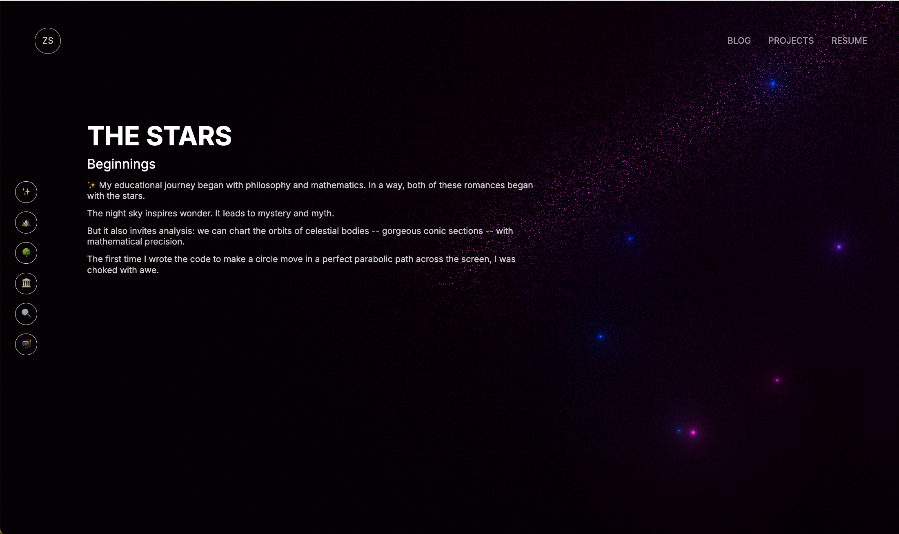
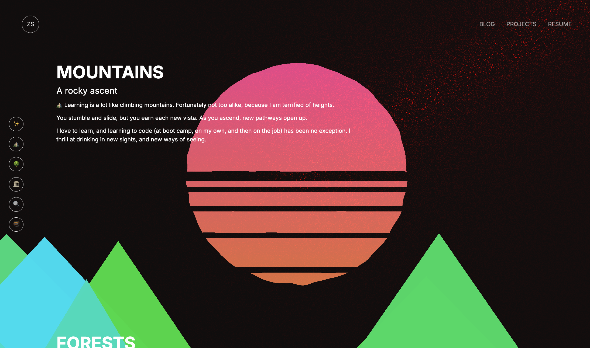
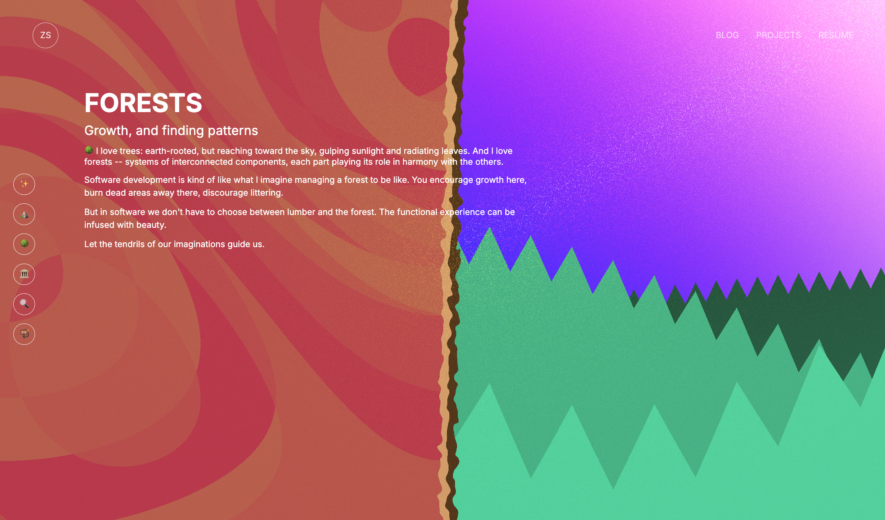
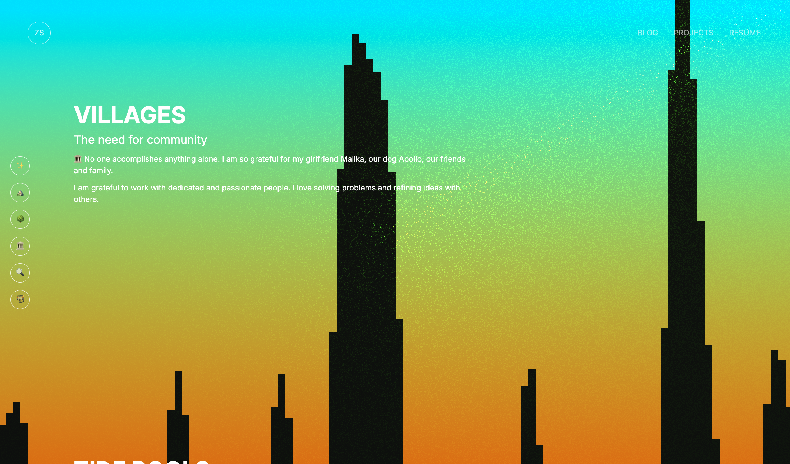
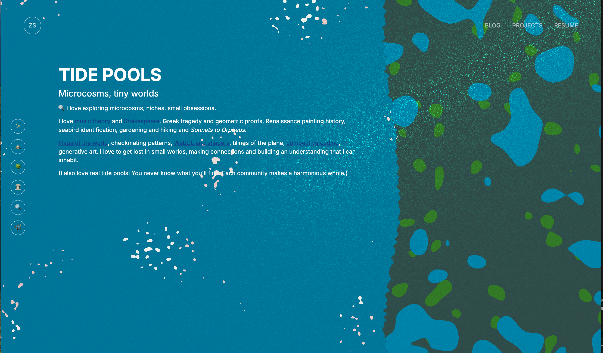

# Personal Site

It was a ton of fun to build the fragment shader that powers the background for my [personal landing page](https://zackstout.github.io/personal-webgl/).

## Screenshots







### Compiles and hot-reloads for development

```
yarn vite
```

### Compiles and minifies for production

```
yarn build
```

### Lints and fixes files

```
yarn lint
```

### Customize configuration

See [Configuration Reference](https://cli.vuejs.org/config/).

### Notes

`yarn vite preview` is nice to show what production should look like.

Ah but now it doesn't work because of "base" in vite.config.js... hmm..
That was needed to get deployment working with Github Pages and Actions.
